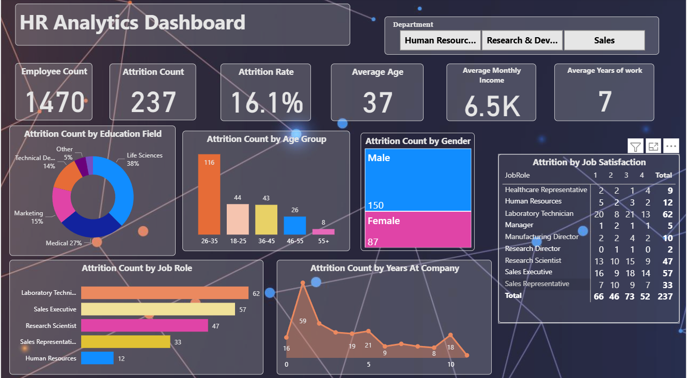

## 📊 HR Analytics Dashboard

### 🔧 Tools Used

* Power BI
* Excel

### 📌 Project Overview

This HR Analytics Dashboard is designed to analyze employee data and identify key factors affecting employee attrition. It helps HR teams make data-driven decisions to improve employee retention and workforce planning.

### 📈 Key Metrics

* Total Employees: 1470
* Attrition Count: 237
* Attrition Rate: 16.1%
* Average Age: 37
* Average Monthly Income: 6.5K
* Average Years at Company: 7

### 🔍 Key Insights

* Highest attrition observed in the **26–35 age group**
* Employees with **lower job satisfaction** show higher attrition
* Certain roles like **Sales Executive & Laboratory Technician** have higher attrition
* Majority attrition comes from **Life Sciences and Medical background**

### 📊 Features

* Department-wise filtering (HR, R&D, Sales)
* Attrition analysis by age, gender, and job role
* Job satisfaction impact on attrition
* Year-wise attrition trend

### 🖼️ Dashboard Preview

### 📁 Files Included

* HR_Analytics_Dashboard.pbix
* screenshot.png

### 🚀 How to Use

1. Download the `.pbix` file
2. Open in Power BI Desktop
3. Interact with filters and visuals

