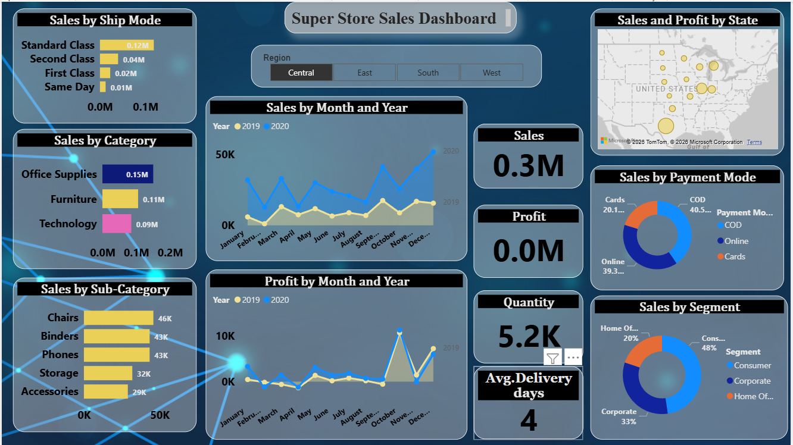

## 📊 Superstore Sales Dashboard (Power BI)

### 🚀 Project Overview

An interactive Power BI dashboard built to analyze sales performance, profitability, and customer trends across different regions and product categories.

---

### 🔧 Tools Used

* Power BI
* Excel

---

### 📊 Key Metrics

* Total Sales
* Total Profit
* Number of Orders
* Profit Margin

---

### 📈 Key Insights

* Technology category generates highest profit
* Furniture category has lower profit margins
* West region shows strong sales performance
* Some products have high sales but low profit (loss-making items)

---

### 📊 Features

* Region-wise filtering
* Category & sub-category analysis
* Sales vs Profit comparison
* Time-based trend analysis

---

### 🖼️ Dashboard Preview

---

### 📁 Files Included

* Superstore_Sales_Dashboard.pbix
* superstore_dashboard.png

---

### 🚀 How to Use

1. Download the `.pbix` file
2. Open in Power BI Desktop
3. Use filters to explore insights

---

### 💼 Business Impact

* Helps identify profitable categories
* Detects loss-making products
* Supports better sales strategy decisions

